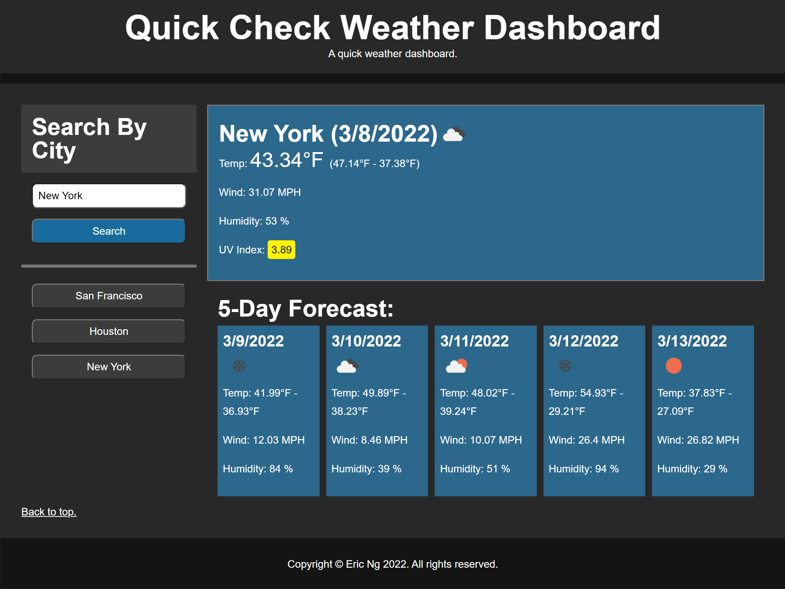

# Quick_Check_Weather_Dashboard

A weather dashboard for quick review based on city or current geographic location.

 

Deployed Here: https://ericng314.github.io/Quick_Check_Weather_Dashboard/

 

 

## Built With

### **Languages, Libraries, and Frameworks:**

| Technology | Type | Description |
| ----------- | ----- | -------- |
| [HTML5](https://www.w3.org/TR/html/) | Language | Standardized system for tagging text files to achieve font, color, graphic, and hyperlink effects on World Wide Web pages. |
| [CSS3](https://developer.mozilla.org/en-US/docs/Web/CSS/CSS3) | Language | Styling html webpages. |
| [Javascript](https://www.javascript.com/) | Language | An object-oriented computer programming language. |
| [Luxon](https://moment.github.io/luxon/#/?id=luxon) | Library | A library for dealing with dates and times in JavaScript. |
| [OpenWeather](https://openweathermap.org/) | API | OpenWeather provides historical, current and forecasted weather data. |

 

## Author
* **Eric Ng** - [EricNg314](https://github.com/EricNg314)